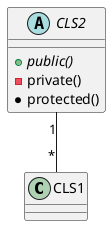

# module-doc-lib
Biblioteca para gerar documentação de projetos de software

```plantuml
@startuml
class CLS1
abstract CLS2 {
    + {abstract} public()
    - private()
    * protected()
}

CLS2 "1"--"*" CLS1
@enduml
```